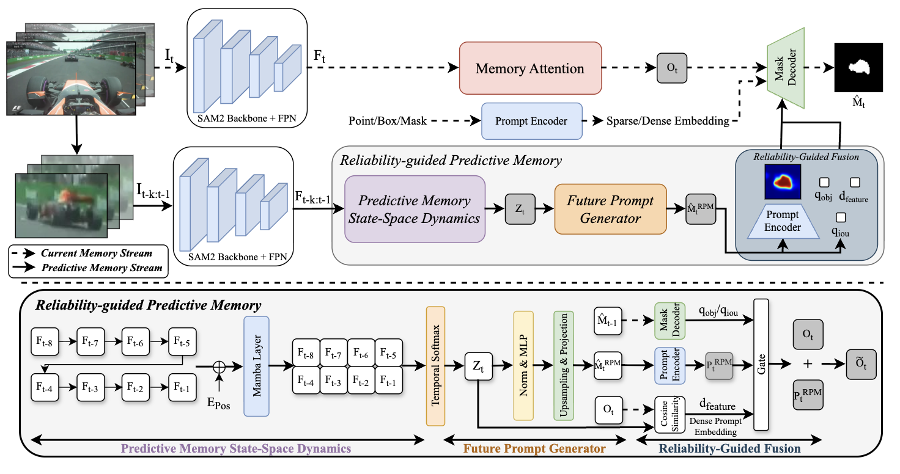

# Memory as Dynamics: Learning Reliability-Guided Predictive Models for Online Video Perception

**Minwoo Kim, [Sang Min Yoon](https://scholar.google.com/citations?user=V6HVW-QAAAAJ&hl=ko&oi=ao)**

HCI Lab, College of Computer Science, Kookmin University, Seoul, Korea

Official implementation of **RPM** (ICML 2026).

<p align="center">
  
</p>

---

## Repository Structure

```
rpm_github/
├── sam2/                     # installable package (`import sam2`)
│   ├── setup.py
│   ├── sam2/
│   │   ├── modeling/backbones/future.py      # FPM: predictive-memory module (Mamba)
│   │   ├── sam2_video_predictor.py           # reliability-guided fusion at inference
│   │   └── configs/
│   │       ├── rpm/lasot/sam2.1_hiera_b+.yaml         # inference (LaSOT)
│   │       ├── rpm/lasotext/sam2.1_hiera_b+.yaml      # inference (LaSOT-ext)
│   │       └── sam2.1_training/sam2.1_hiera_b+_RPM_train.yaml   # training
│   ├── training/             # training loop, FPM losses, datasets
│   └── checkpoints/          # model weights (git-ignored)
├── scripts/                  # inference entry points (LaSOT / LaSOT-ext)
├── tools/                    # evaluation (success AUC)
├── requirements.txt
└── README.md
```

---

## Environment Setup

Requires a CUDA GPU (Mamba kernels are CUDA-only). Tested with Python 3.10 and
CUDA 12.x.

### Option A — conda (recommended)

```bash
conda create -n rpm python=3.10 -y
conda activate rpm

# Install PyTorch matching your CUDA version (see https://pytorch.org).
# Example for CUDA 12.1:
pip install torch==2.3.1 torchvision==0.18.1 --index-url https://download.pytorch.org/whl/cu121
```


### Install the remaining dependencies

```bash
pip install -r requirements.txt
```

### Install Mamba (predictive-memory dynamics)

```bash
pip install packaging ninja setuptools wheel
pip install causal-conv1d==1.4.0 --no-build-isolation --no-deps
pip install mamba-ssm==2.2.2     --no-build-isolation --no-deps
```

### Install the `sam2` package

```bash
cd sam2
pip install -e .    
cd ..
```

---

## Data and Checkpoints

### Datasets

Download and lay out the tracking datasets as:

```
LaSOT/
├── testing_set.txt              # list of test video names
└── <video>/
    ├── img/00000001.jpg ...
    └── groundtruth.txt          # x,y,w,h per frame

LaSOT_ext/                       # same layout as LaSOT
```

Training uses video-segmentation data (SA-V, optionally MOSE / VOS-2019). Edit
the paths in `sam2/sam2/configs/sam2.1_training/sam2.1_hiera_b+_RPM_train.yaml`.

### Checkpoints

Weights live under `sam2/checkpoints/` (git-ignored).

Download the base SAM 2.1 weights (needed to initialize training and for the
SAM2 backbone):

```bash
cd sam2/checkpoints
bash download_ckpts.sh
cd ../..
```

| file | purpose |
|------|---------|
| `sam2.1_hiera_base_plus.pt` | base SAM 2.1 weights (from `download_ckpts.sh`), to initialize training |
| `rpm_hiera_b+.pt` | RPM weights produced by training, used for inference |

---

## Training

RPM training **only learns the predictive prompt (FPM)** — the SAM2 backbone is
frozen. Run from the `sam2/` directory:

```bash
cd sam2
python training/train.py \
    -c configs/sam2.1_training/sam2.1_hiera_b+_RPM_train.yaml \
    --use-cluster 0 \
    --num-gpus 4
```

- `--num-gpus`: number of GPUs on this node.
- The base SAM 2.1 checkpoint is read from
  `./checkpoints/sam2.1_hiera_base_plus.pt` (set in the config).
- Trained checkpoints are written under the experiment log directory; copy the
  final one to `sam2/checkpoints/rpm_hiera_b+.pt` for inference.

---

## Inference

### LaSOT (single process)

```bash
python scripts/main_inference_lasot.py \
    --data_root /path/to/LaSOT \
    --checkpoint sam2/checkpoints/rpm_hiera_b+.pt \
    --config configs/rpm/lasot/sam2.1_hiera_b+.yaml \
    --output results/lasot
```

### LaSOT / LaSOT-ext (chunked across GPUs)

```bash
# LaSOT-ext, 4 processes / 4 GPUs
for i in 0 1 2 3; do
  CUDA_VISIBLE_DEVICES=$i python scripts/main_inference_chunk_ext.py \
      --data_root /path/to/LaSOT_ext \
      --checkpoint sam2/checkpoints/rpm_hiera_b+.pt \
      --config configs/rpm/lasotext/sam2.1_hiera_b+.yaml \
      --output results/lasot_ext --chunk_idx $i --num_chunks 4 &
done
wait
```

`main_inference_chunk_lasot.py` is the LaSOT counterpart (same arguments).
Each script writes one `<video>.txt` per sequence (`x,y,w,h` per frame).

---

## Acknowledgements

Built on [SAM 2](https://github.com/facebookresearch/sam2). The long-term memory
management follows [HiM2SAM](https://github.com/dyhBUPT/HiM2SAM); the
predictive-memory dynamics use [Mamba](https://github.com/state-spaces/mamba).

## Citation

```bibtex
@inproceedings{kim2026rpm,
  title     = {Memory as Dynamics: Learning Reliability-Guided Predictive Models for Online Video Perception},
  author    = {Kim, Minwoo and Yoon, Sang Min},
  booktitle = {International Conference on Machine Learning (ICML)},
  year      = {2026}
}
```
